# Kafka: ручная установка с ZooKeeper

+ [Ручная установка Kafka](#Ручная-установка-Kafka)
+ [Создать bat файл для упрощенного запуска](#Создать-bat-файл-для-упрощенного-запуска)
+ [Установка Kafka через Docker](#Установка-Kafka-через-Docker)


## Ручная установка Kafka

### 🔽 Шаг 1. Скачай Kafka
Перейди на официальный сайт:
👉 https://kafka.apache.org/downloads

Скачай Kafka 3.9.1 Scala 2.13: (или последнюю версию с ZooKeeper)

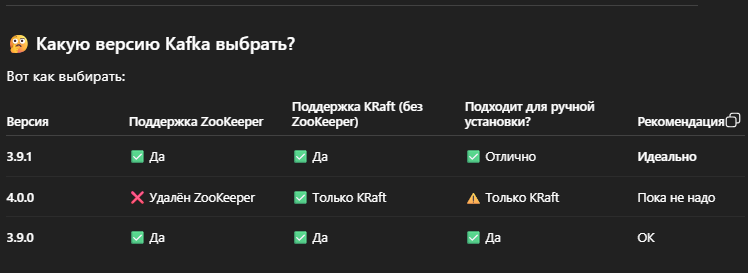

Распакуй архив, например в C:\kafka

В итоге должен получиться путь вроде:
`C:\kafka\kafka_2.13-3.9.1`

### ⚙️ Шаг 2. Запусти ZooKeeper
>Kafka (до версии 3.x) требует ZooKeeper. Он уже есть в дистрибутиве.

1) Открой терминал в папке (shift + правая кнопка мыши) `C:\kafka\kafka_2.13-3.9.1`

2) Запусти ZooKeeper:
```bash
.\bin\windows\zookeeper-server-start.bat .\config\zookeeper.properties

```
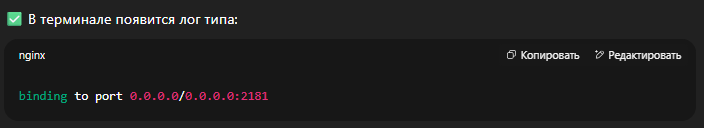
Такая строчка появилась 
>[2025-08-03 15:27:07,797] INFO binding to port 0.0.0.0/0.0.0.0:2181 (org.apache.zookeeper.server.NIOServerCnxnFactory)
такая строчка появилась

### ⚙️ Шаг 3. Запусти Kafka Broker
В новом терминале (не закрывая ZooKeeper):
```bash
.\bin\windows\kafka-server-start.bat .\config\server.properties
```
✅ Увидишь лог:
```bash
[2025-08-03 15:31:30,855] INFO [KafkaServer id=0] started (kafka.server.KafkaServer)
```
Теперь у тебя работает один Kafka broker и один ZooKeeper сервер — ты готов к работе.

### 🧪 Шаг 4. Проверь — создай топик и отправь сообщение
1) Создай топик:
```bash
.\bin\windows\kafka-topics.bat --create --topic test-topic --bootstrap-server localhost:9092 --partitions 1 --replication-factor 1
```
```bash 
Created topic my-topic.//такое появится
```
2) Проверь список топиков:
```bash
.\bin\windows\kafka-topics.bat --list --bootstrap-server localhost:9092
```
3) Запусти продюсера:
```bash
.\bin\windows\kafka-console-producer.bat --topic test-topic --bootstrap-server localhost:9092
```

Вводи строки — они отправляются в Kafka.

4) В новом окне запусти консюмера:
```bash
.\bin\windows\kafka-console-consumer.bat --topic test-topic --from-beginning --bootstrap-server localhost:9092
```
✅ Увидишь свои сообщения. Всё работает!

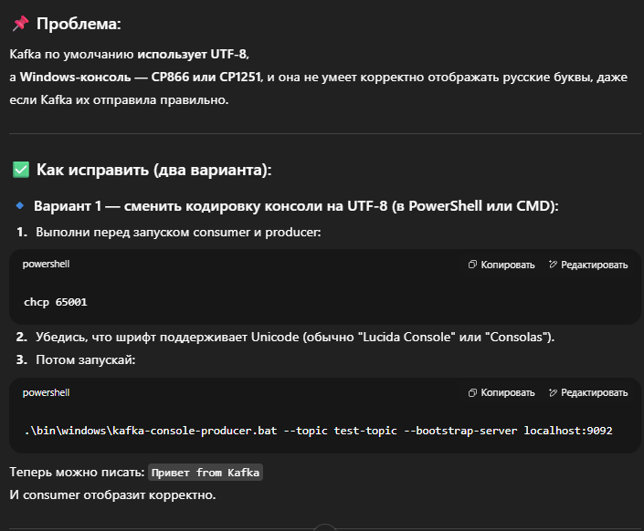
Или просто работать через Git Bash

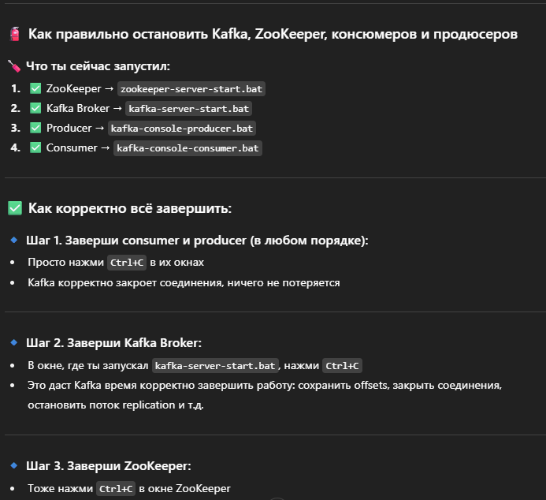

### 💣 Не обязательно:
+ Удалять топики — Kafka хранит их, пока ты сам не удалишь или не истечёт время хранения (по умолчанию 7 дней).
+ Удалять логи вручную — Kafka сама это делает по retention policy, но ты можешь это делать при отладке (расскажу позже).

## Создать bat файл для упрощенного запуска

🛠️ 1. Где создать .bat-файл
Лучше всего положить его прямо в корень Kafka-директории:
```bash
C:\kafka\kafka_2.13-3.9.1
```

### Например:
- start-kafka.bat — для запуска

### ▶️ 2. Содержимое start-kafka.bat
```bash
@echo off
echo 🔁 Запуск ZooKeeper...
start "ZooKeeper" cmd /k "cd /d %~dp0 && bin\windows\zookeeper-server-start.bat config\zookeeper.properties"

timeout /t 5 > nul

echo 🚀 Запуск Kafka Broker...
start "Kafka" cmd /k "cd /d %~dp0 && bin\windows\kafka-server-start.bat config\server.properties"

```
### 📌 Что делает:
- Открывает два отдельных окна (cmd /k) — одно для ZooKeeper, одно для Kafka
- %~dp0 — путь к текущей папке (работает, где бы ни лежал .bat)
- timeout /t 5 — ждёт 5 секунд перед запуском Kafka (чтобы ZooKeeper успел подняться)

###  3. ✏️ Как создать .bat-файл:
- Открой Блокнот
- Вставь код
- Сохрани как: start-kafka.bat
- Обязательно выбери: Тип файла: Все файлы, а не .txt
- Проверь: файл должен быть start-kafka.bat, а не start-kafka.bat.txt

## Установка Kafka через Docker

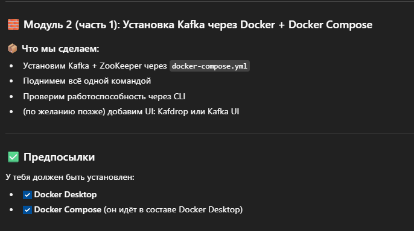
Сначало ставим докер, вот как проверить какой дистрибутив тебе нужен
```bash
echo %PROCESSOR_ARCHITECTURE%
```
У меня AMD64
Качаем 👉 https://www.docker.com/products/docker-desktop/
устанавливаем
```bash
C:\Users\evgen>docker --version
Docker version 28.3.2, build 578ccf6

C:\Users\evgen>docker-compose --version
Docker Compose version v2.38.2-desktop.1
```

### 🧱 Шаг 1: Создай папку для Kafka через Docker
> В любом удобном для тебя месте я создал на диске D:/docker/kafka-docker/
### 📝 Шаг 2: Создай файл docker-compose.yml со следующим содержимым:
Положил сюда D:/docker/kafka-docker/docker-compose.yml

```yml
version: '3.8'

services:
  zookeeper:
    image: confluentinc/cp-zookeeper:7.5.0
    container_name: zookeeper
    environment:
      ZOOKEEPER_CLIENT_PORT: 2181
      ZOOKEEPER_TICK_TIME: 2000
    ports:
      - "2181:2181"

  kafka:
    image: confluentinc/cp-kafka:7.5.0
    container_name: kafka
    depends_on:
      - zookeeper
    ports:
      - "9092:9092"
    environment:
      KAFKA_BROKER_ID: 1
      KAFKA_ZOOKEEPER_CONNECT: zookeeper:2181
      KAFKA_ADVERTISED_LISTENERS: PLAINTEXT://localhost:9092
      KAFKA_OFFSETS_TOPIC_REPLICATION_FACTOR: 1

```
Пояснения по файлу
- version: '3.8' Указывает версию спецификации Docker Compose
- services:🔹 Здесь мы описываем, какие сервисы (контейнеры) нужно поднять. У нас их два: zookeeper и kafka.
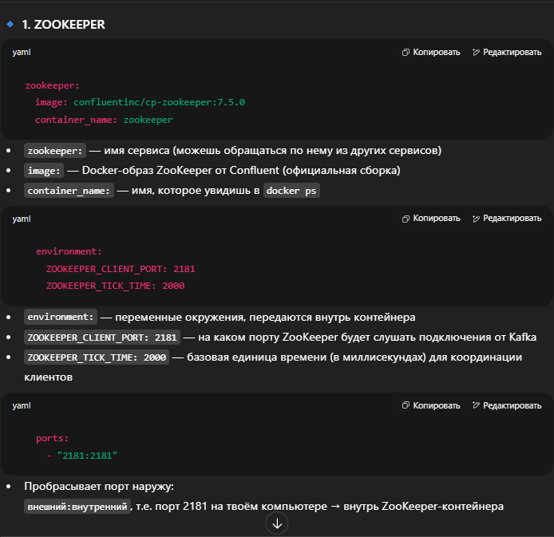

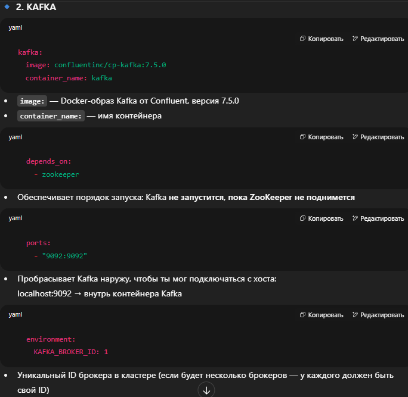
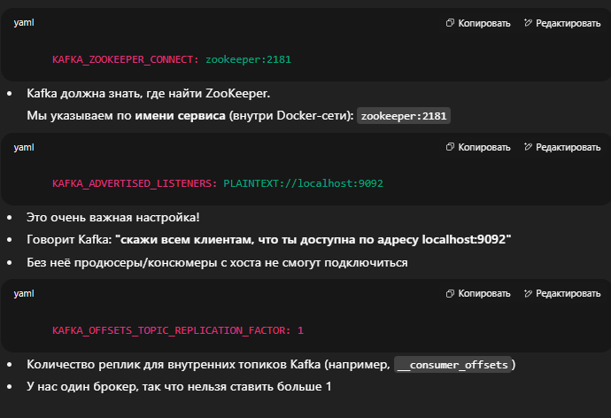

### 📦 ИТОГО
Ты запускаешь:
- Один контейнер с ZooKeeper (confluentinc/cp-zookeeper)
- Один контейнер с Kafka (confluentinc/cp-kafka)
- Они автоматически связываются между собой внутри виртуальной сети Docker
- Порты проброшены наружу, так что ты можешь подключаться локально

### ▶️ Шаг 3: Запусти Kafka и ZooKeeper

Находясь в  D:/docker/kafka-docker/

```bash
docker-compose up -d
```

После как все скачает закончить должен такими логами примерно
```bash
 Network kafka-docker_default  Creating
 Network kafka-docker_default  Created
 Container zookeeper  Creating
 Container zookeeper  Created
 Container kafka  Creating
 Container kafka  Created
 Container zookeeper  Starting
 Container zookeeper  Started
 Container kafka  Starting
 Container kafka  Started

```

Проверяем что все работает
```bash
docker ps
```
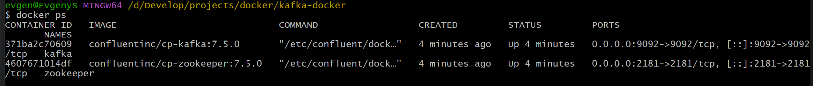

### Ты красавчик 👏 — на этом этапе ты уже почти развернул Kafka-кластер.

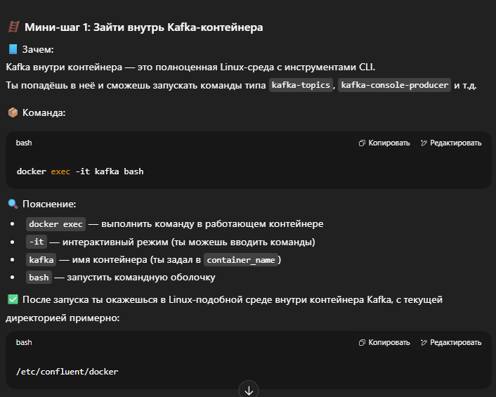
>!!!Если будет не получаться команда `docker exec -it kafka bash`
> Введи такую `winpty docker exec -it kafka bash`
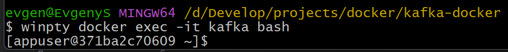

### Теперь ты находишься в Linux-среде внутри контейнера Kafka:
- Пользователь: appuser
- Директория: /home/appuser
- Kafka утилиты (kafka-topics, kafka-console-producer, kafka-console-consumer) доступны из любой директории, потому что они прописаны в PATH
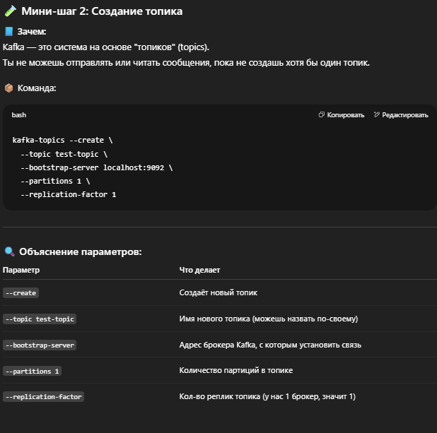
```bash
kafka-topics --create --topic test-topic --bootstrap-server localhost:9092 --partitions 1 --replication-factor 1
```

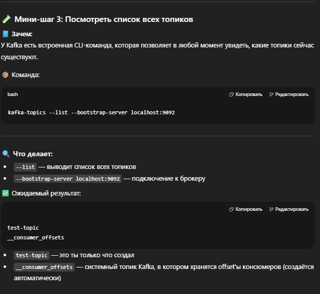
```bash
kafka-topics --list --bootstrap-server localhost:9092

```
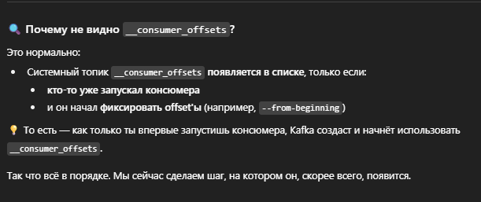

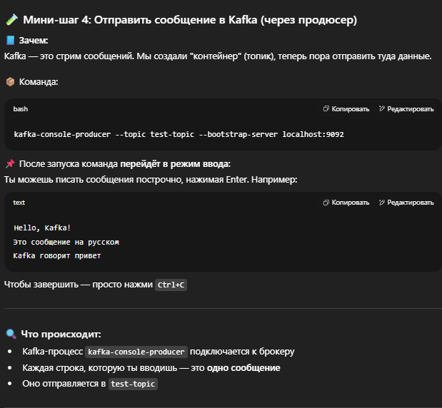
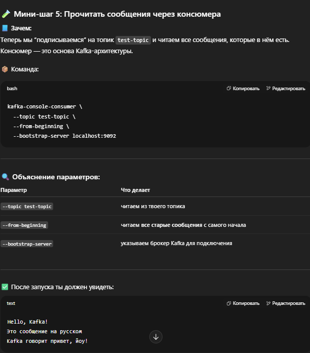