# Продюсер и консюмер

+ [Практика Consumer Producer](#Практика-Consumer-Producer)


## Практика Consumer Producer
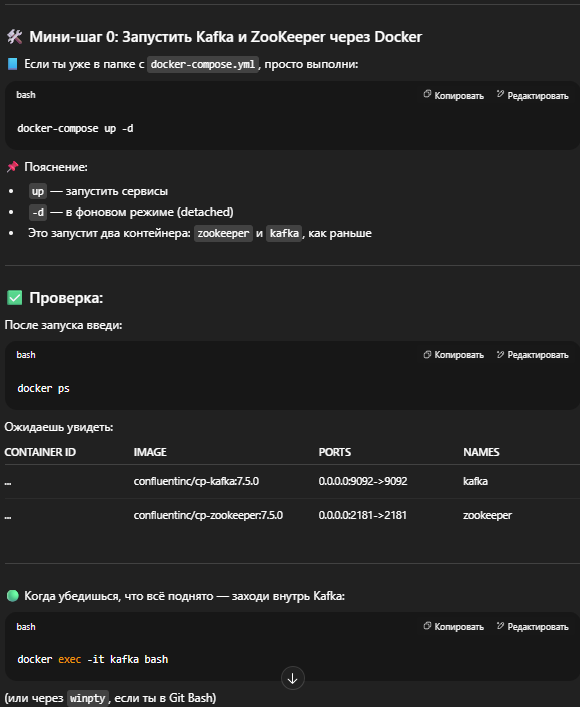
Запускаем наш файл который поднимет контейнер зукипера и кафки

- Если ты уже в папке с docker-compose.yml, просто выполни(запуск zookeeper + kafka):
`docker-compose up -d`
- Проверка что контейнеры запустились
  `docker ps`
-  Когда убедишься, что всё поднято — заходи внутрь Kafka:
   `docker exec -it kafka bash`
- создадим топик изнутри контейнера кафка
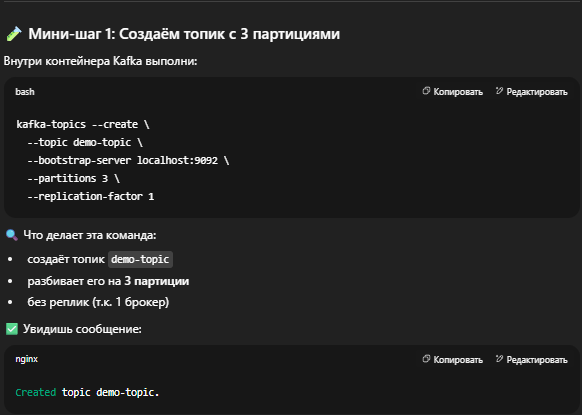
```bash
kafka-topics --create --topic demo-topic --bootstrap-server localhost:9092 --partitions 3 --replication-factor 1 
```

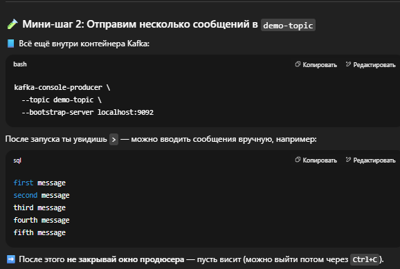
- запускаем produser
```bash
  kafka-console-producer --topic demo-topic --bootstrap-server localhost:9092
```

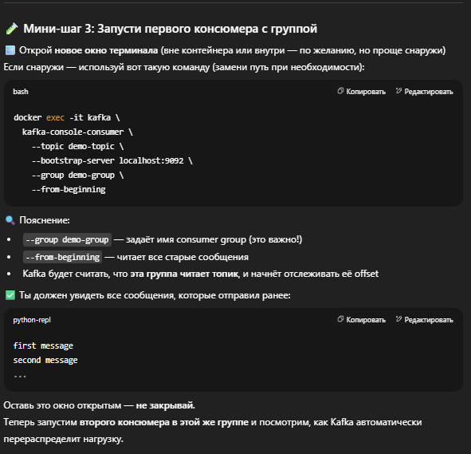
- запускаем консюмера(можно не находясь внутри контейнера просто добавить вначало "docker exec -it kafka")
  `C:\Users\evgen>docker exec -it kafka kafka-console-consumer --topic demo-topic --bootstrap-server localhost:9092 --group demo-group --from-beginning`
 > видимо что команды docker понимает с любого места, ниже чистая команда без  C:\Users\evgen>
```bash
docker exec -it kafka kafka-console-consumer --topic demo-topic --bootstrap-server localhost:9092 --group demo-group --from-beginning
```
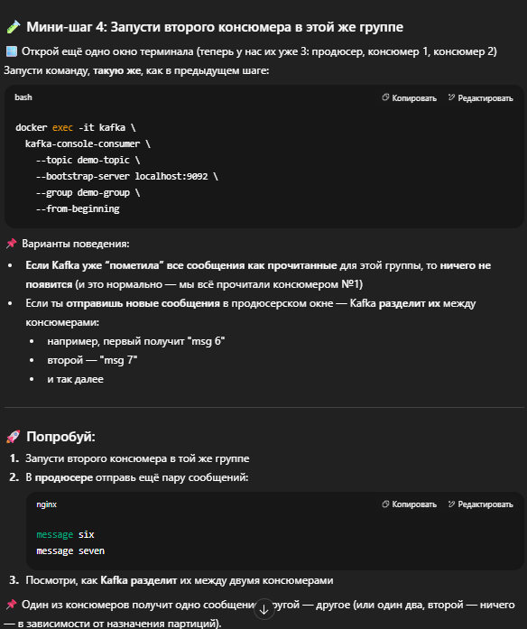
- запускаем второго консюмера(точно такая же команда как выше)
```bash
docker exec -it kafka kafka-console-consumer --topic demo-topic --bootstrap-server localhost:9092 --group demo-group --from-beginning
```

>первый консюмер который вычитал сразу 5 - ничего не получил
второй который запустили был пустым потому что в топике не было сообщений на тот момент
Написал одно нажал отправить и сразу написал второе
в итоге их вычитал второй консюмер у которого не было сообщений

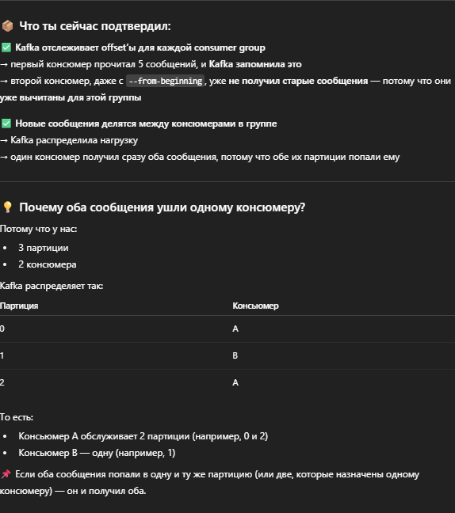

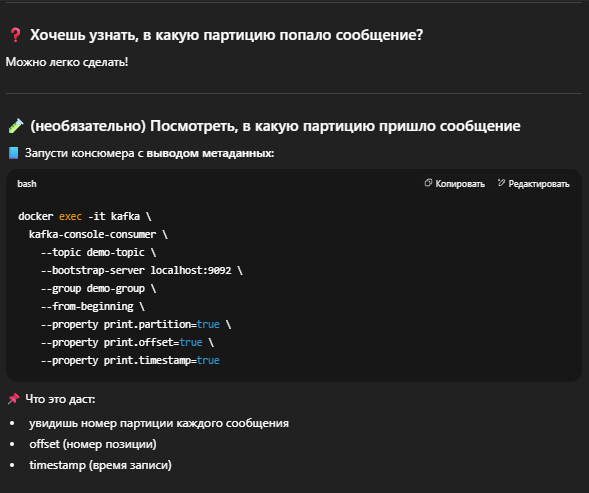

- запускаем консюмера с выводом метаданных
```bash
  docker exec -it kafka kafka-console-consumer --topic demo-topic --bootstrap-server localhost:9092 --group demo-group --from-beginning --property print.partition=true --property print.offset=true --property print.timestamp=true
```
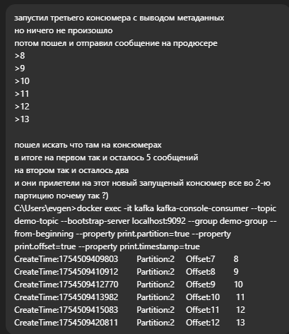
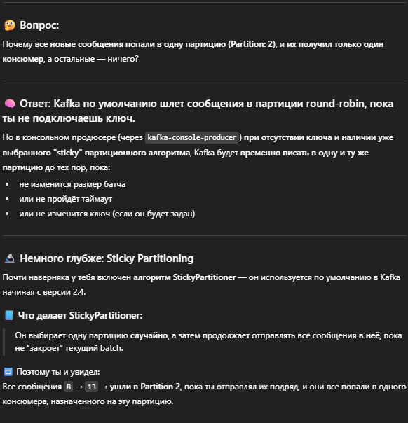
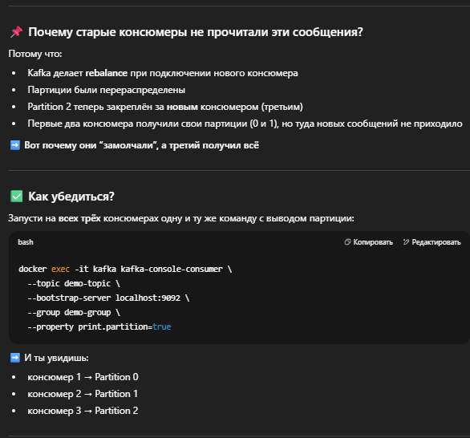
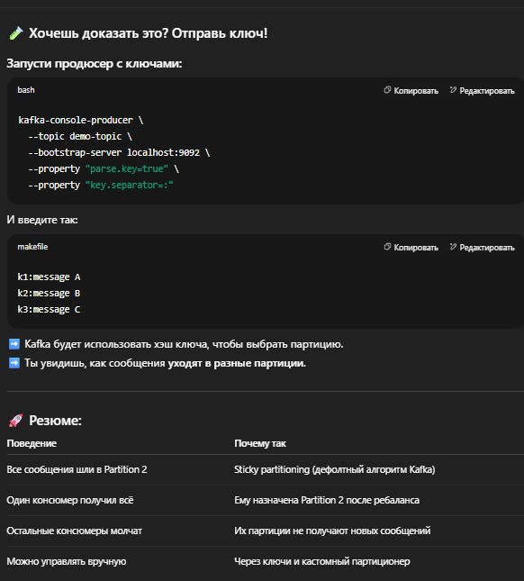

- Команда для запуска с выводом партиции:
```bash
  docker exec -it kafka kafka-console-consumer --topic demo-topic --bootstrap-server localhost:9092 --group demo-group --property print.partition=true --property print.offset=true --property print.timestamp=true
```
> Отправил много сообщений цифрами 14 потом 15 потом 16 и так до 30
> в итоге в 1 и 3 пусто
все пришли во второй консюмер

```bash
C:\Users\evgen>docker exec -it kafka kafka-console-consumer --topic demo-topic --bootstrap-server localhost:9092 --group demo-group --property print.partition=true --property print.offset=true --property print.timestamp=true
CreateTime:1754510064568        Partition:2     Offset:13       14
CreateTime:1754510065976        Partition:2     Offset:14       15
CreateTime:1754510067028        Partition:2     Offset:15       16
CreateTime:1754510068607        Partition:2     Offset:16       17
CreateTime:1754510070374        Partition:2     Offset:17       18
CreateTime:1754510071638        Partition:2     Offset:18       19
CreateTime:1754510073451        Partition:2     Offset:19       20
CreateTime:1754510074726        Partition:2     Offset:20       21
CreateTime:1754510075664        Partition:2     Offset:21       22
CreateTime:1754510076791        Partition:2     Offset:22       23
CreateTime:1754510077803        Partition:2     Offset:23       24
CreateTime:1754510078833        Partition:2     Offset:24       25
CreateTime:1754510080655        Partition:2     Offset:25       26
CreateTime:1754510081951        Partition:2     Offset:26       27
CreateTime:1754510083223        Partition:2     Offset:27       28
CreateTime:1754510084560        Partition:2     Offset:28       29
CreateTime:1754510085957        Partition:2     Offset:29       30
```

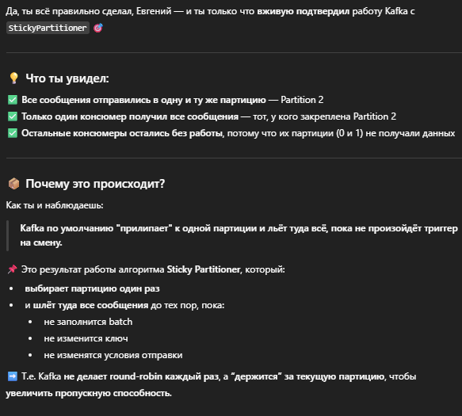
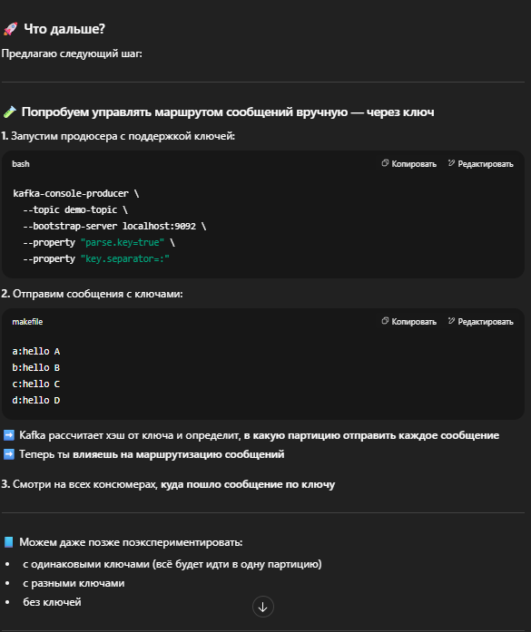