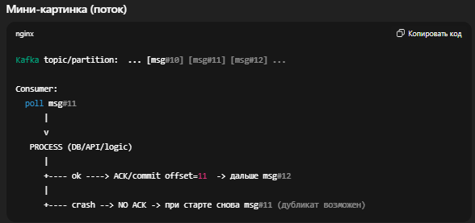
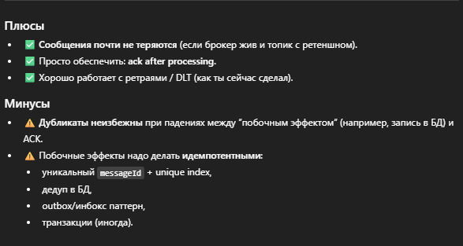

### At-least-once
— это гарантия доставки Kafka “сообщение будет обработано минимум один раз”. Цена за это: возможны повторы (дубликаты).
>Хотя бы один раз — сообщения никогда не теряются, но могут быть доставлены повторно.

### Как это работает (идея)

Ключевой момент: offset коммитится ПОСЛЕ успешной обработки.

+ Если обработали → ACK/commit offset → Kafka считает сообщение “закрытым”.

+ Если упали до ACK → offset не закоммичен → Kafka при перезапуске/ребалансе даст то же сообщение снова.

### Где применимо (и почему это нормально)

__At-least-once__ — базовый и самый распространённый режим в проде, когда:

+ потеря сообщений недопустима (заказы, платежи, аудит, уведомления, события домена),
+ ты готов справляться с повторной доставкой.

### Частая формула в проде:

>At-least-once + Idempotent consumer = “эффект exactly-once” на уровне твоей системы

>Тут был воспроизведен чистый кейс, как есть - доставка хотябы один раз, 
> сообщения не теряются, но могут быть дубликаты

