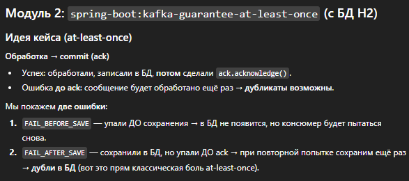
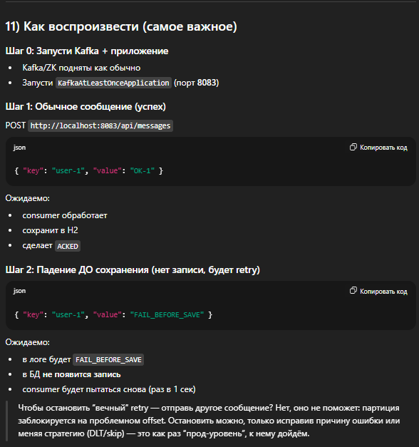
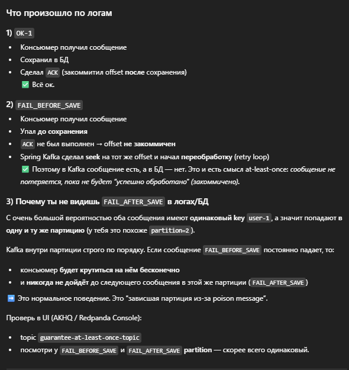
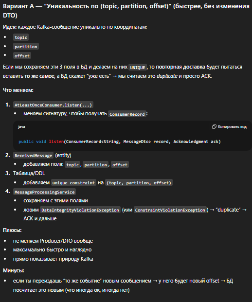
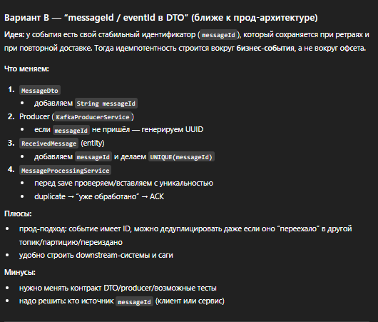

>Хотя бы один раз — сообщения никогда не теряются, но могут быть доставлены повторно.

>Тут был воспроизведен чистый кейс, как есть - доставка хотябы один раз, 
> сообщения не теряются, но могут быть дубликаты

