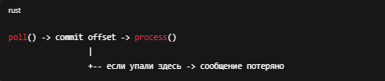
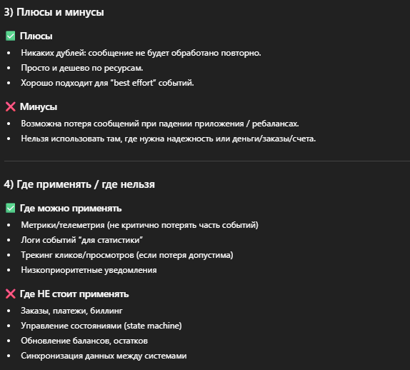
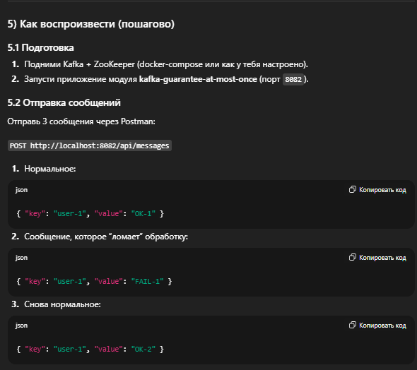
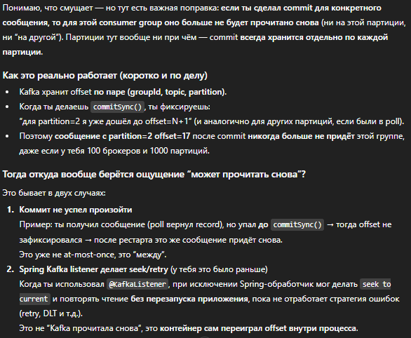

# Kafka Delivery Guarantee: At-Most-Once (Spring Boot demo)

Этот модуль показывает гарантию доставки **at-most-once**:  
**сообщение может потеряться**, но **дубликатов не будет**.

---

## 1) Что такое At-Most-Once

**At-most-once** = *"доставим не более одного раза"*.

Это достигается тем, что **offset коммитится слишком рано** (часто — автоматически),
и если приложение упало **после коммита**, но **до реальной обработки**, сообщение считается обработанным и **повторно не придёт**.

### Визуальная схема (почему возможна потеря)

## 2) Ключевая идея и настройки

### At-most-once обычно получается так:

enable.auto.commit=true (offset коммитится автоматически)
auto.commit.interval.ms=1000 (например, раз в 1 секунду)
обработка сообщения происходит после доставки, но offset может быть уже закоммичен
В этом модуле именно это и настроено.

## 5.3 Что должно произойти

+ Consumer получит OK-1 и обработает.
+ На FAIL-1 consumer упадёт (в коде специально throw new RuntimeException(...)).
+ Перезапусти приложение.
+ При at-most-once возможно поведение:
+ FAIL-1 не переиграется (сообщение потеряно),
+ потому что offset мог быть уже закоммичен автоматически.

>Если потеря не проявилась с первого раза:
это нормально (автокоммит “временной”). Усилим демонстрацию — добавим небольшую задержку (Thread.sleep) перед падением, чтобы автокоммит почти гарантированно успел пройти.

## 6) Что нужно запомнить

+ At-most-once = возможно потерять, зато без дублей.
+ Это обычно следствие раннего коммита offset (особенно enable.auto.commit=true).
+ Для надежных систем чаще используют at-least-once + идемпотентность / dedup,
либо “effectively-once” через транзакции/БД.

>Выше описана настройка через листнер но для гарантированного воспроизведения с переделал через низгоуровневый консюмер

