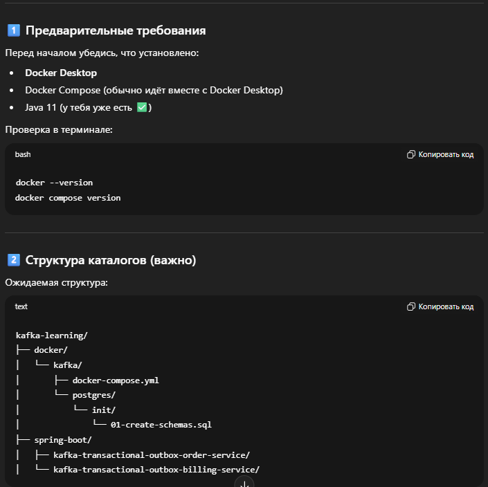

### 1) запуск docker compose
Из пути PS D:\Develop\projects\Java\Java\kafka-projects\kafka-learning\docker\kafka>

запусти `docker compose up -d`

проверка что контейнеры запустились `docker compose ps`


### Важный нюанс про “первый запуск” и volume
Init SQL выполняется только когда volume пустой (первый старт Postgres).
Если Postgres уже запускался и volume pgdata_outbox существует — скрипт не выполнится.

```bash
docker compose down -v
docker compose up -d
```
> -v удалит данные Postgres в volume (для учебного демо это нормально).

### 2) Подключаемся к Postgres внутри контейнера:

```bash
docker exec -it postgres psql -U outbox -d kafka_outbox
```
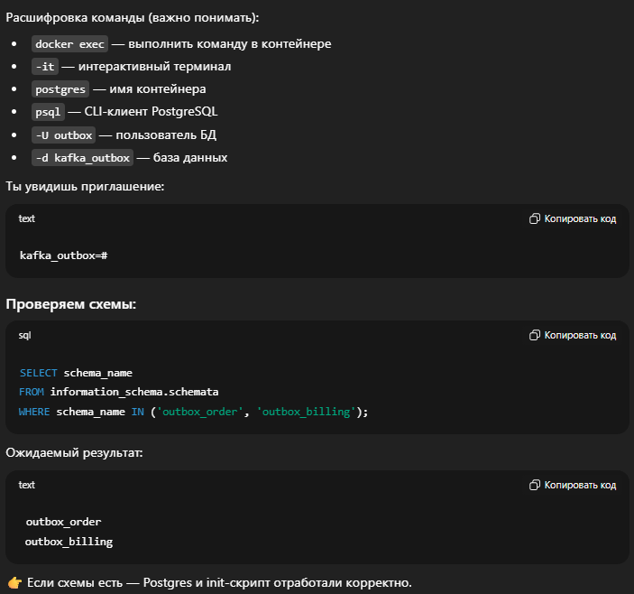

### 3) Kafka
Kafka UI (для визуальной проверки)
После старта доступны UI:
AKHQ → http://localhost:8088
Kafdrop → http://localhost:9000
Redpanda Console → http://localhost:8089

### 4) Остановка и полный сброс окружения
Остановить контейнеры:
```bash
docker compose down
```

Полный сброс (включая БД):
```bash
docker compose down -v
```

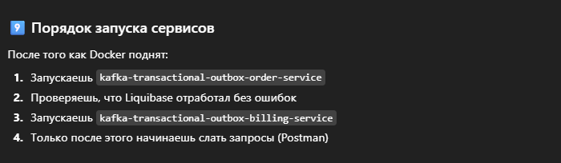

📌 Создание Kafka topic и проверка данных

Перед тем как отправлять запросы в order-service, Kafka topic должен существовать.
Иначе publisher не сможет отправить сообщение.

Мы используем topic: orders.events

🔹 10️⃣ Создание Kafka topic

Есть два равноправных способа — через CLI и через UI.

🅰️ Способ 1. Через Kafka CLI (рекомендуется для понимания)
Выполняется один раз.

```bash
docker exec -it kafka kafka-topics --bootstrap-server kafka:29092 --create --topic orders.events --partitions 3 --replication-factor 1
```

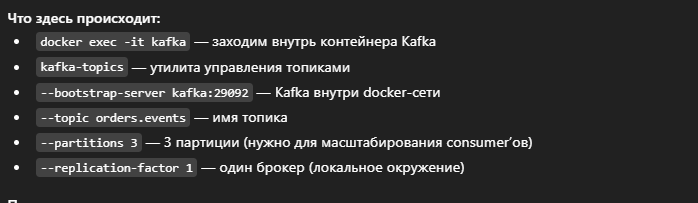

Проверка:

```bash
docker exec -it kafka kafka-topics --bootstrap-server kafka:29092 --list
```

В списке должен быть : orders.events

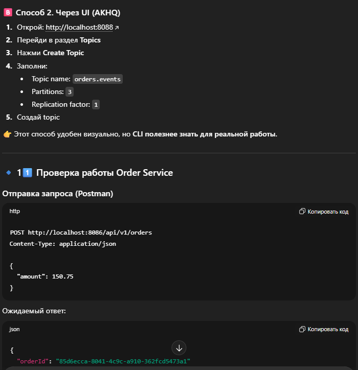


### 5) Подключение к БД

```bash
docker exec -it postgres psql -U outbox -d kafka_outbox
```

```sql
SELECT
  id,
  amount,
  status,
  created_at
FROM outbox_order.orders
ORDER BY created_at DESC;

```

> !!! новая запись status = NEW

```sql
SELECT
  id,
  aggregate_type,
  aggregate_id,
  event_type,
  status,
  retry_count,
  created_at,
  payload
FROM outbox_order.outbox_event
ORDER BY created_at DESC;

```

> Если publisher еще не запускался ожидаем 
> status = NEW
>payload — JSON с orderId и amount

### 📤 Таблица outbox — ПОСЛЕ publisher

После того как OutboxPublisher отработал:

```sql
SELECT
  id,
  status,
  sent_at,
  retry_count,
  last_error
FROM outbox_order.outbox_event
ORDER BY created_at DESC;

```

+ status = SENT
+ sent_at заполнено
+ retry_count = 0
+ last_error = NULL


### 6) Проверка сообщений в Kafka

```bash
docker exec -it kafka kafka-console-consumer \
  --bootstrap-server kafka:29092 \
  --topic orders.events \
  --from-beginning \
  --property print.key=true \
  --property print.value=true

```

Должен увидеть:

```bash
85d6ecca-8041-4c9c-a910-362fcd5473a1 {"amount":150.75,"orderId":"85d6ecca-8041-4c9c-a910-362fcd5473a1"}

```

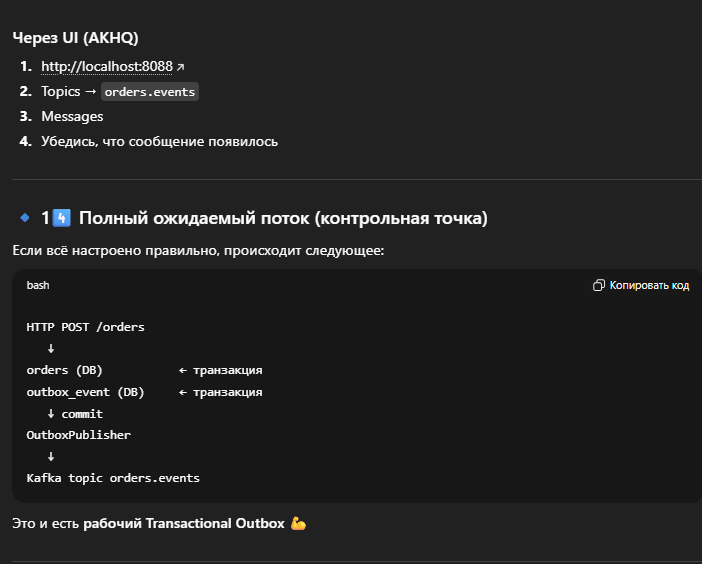


### Немного о Liquibase
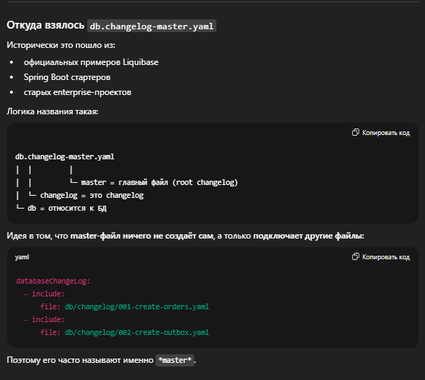

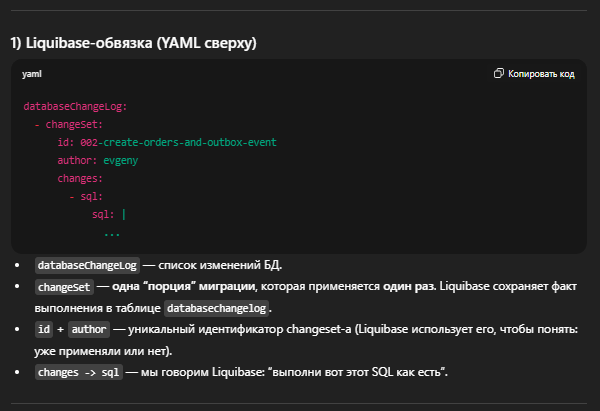

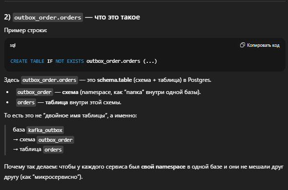

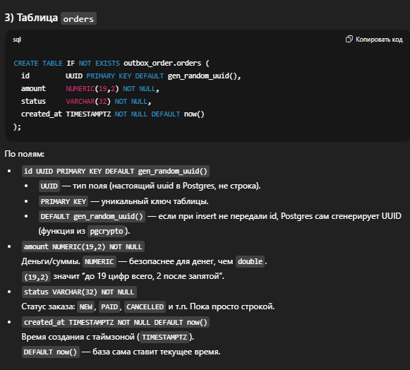

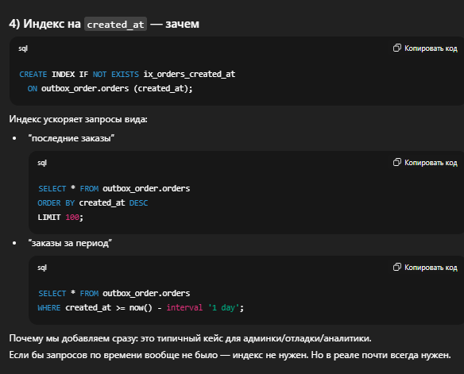

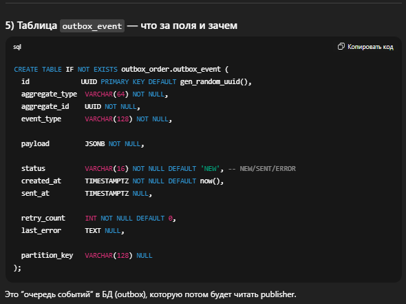

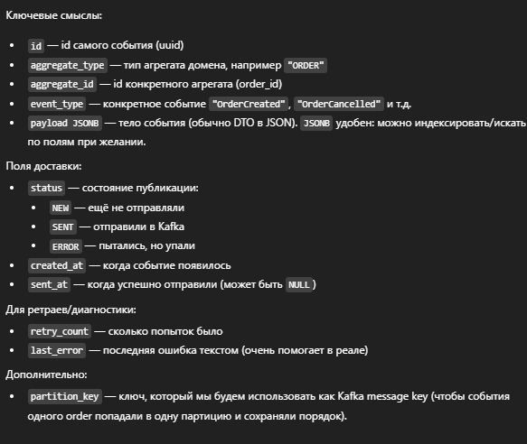

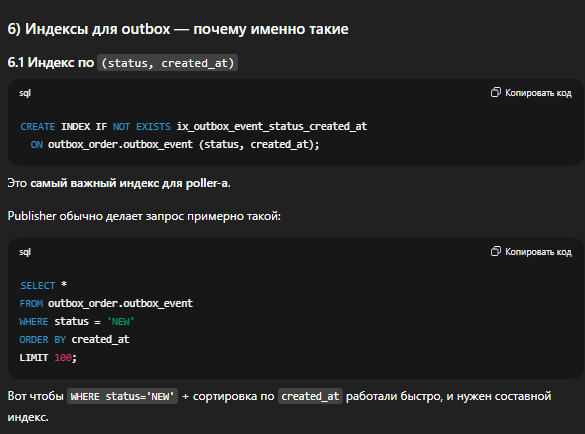

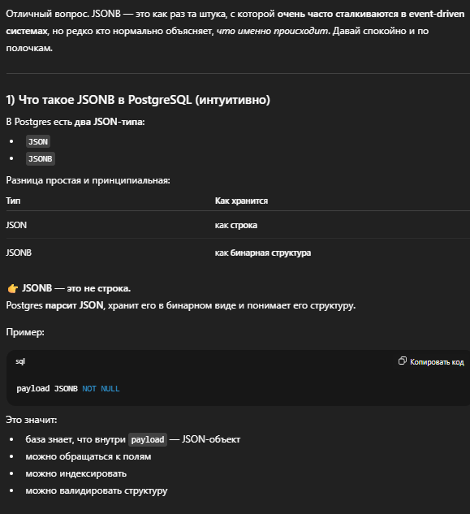

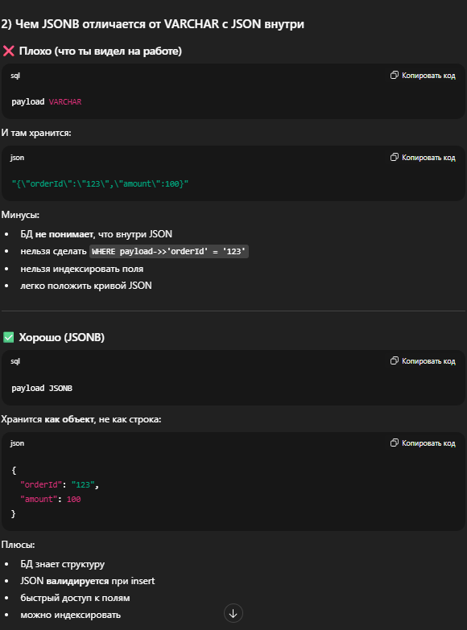

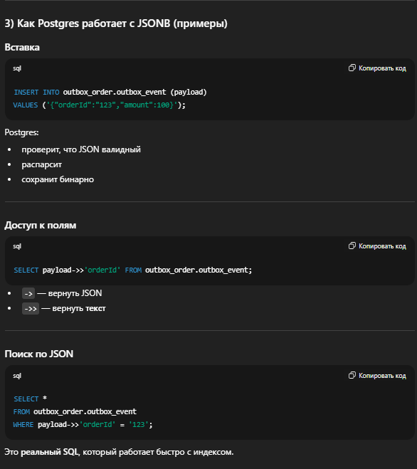


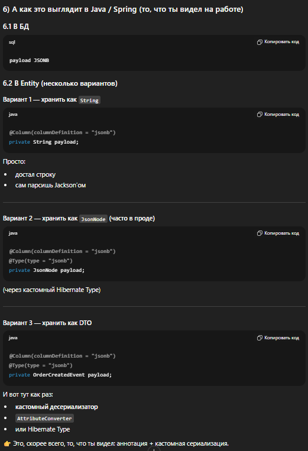

### Проверка в Postgres что таблицы при поднятом сервисе накатились через Liquibase

```bash
docker exec -it postgres psql -U outbox -d kafka_outbox -c "\dt outbox_order.*"
```

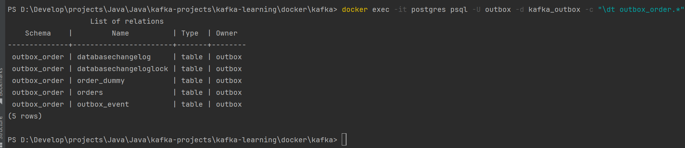

### Зайти в Postgres 

```bash
docker exec -it postgres psql -U outbox -d kafka_outbox
```
`docker exec` - зайти внутрь контейнера и выполнить там команду

`it` - Это два флага сразу
+ -i — interactive Оставляет stdin открытым (можно вводить команды)
+ -t — tty
  Выделяет псевдотерминал (чтобы был нормальный интерактив)
>📌 Без -it ты бы:
не смог вводить SQL
не увидел нормальный prompt kafka_outbox=#
 Для любых интерактивных CLI (psql, bash, sh) — почти всегда -it.

`postgres` -  имя контейнера 

`psql` - это PostgreSQL CLI-клиент, который:

+ уже установлен внутри official postgres image
+ умеет подключаться к БД и выполнять SQL

`-U outbox` - 👉 -U = user Под каким пользователем логинимся в Postgres
Это НЕ Linux-пользователь, а Postgres role.

`-d kafka_outbox` - 👉 -d = database В какую БД подключаемся

>Итого: «Зайти в контейнер postgres, запустить psql, подключиться к БД kafka_outbox под пользователем outbox»

### Посмотреть заказы

```sql
SELECT id, amount, status, created_at
FROM outbox_order.orders
ORDER BY created_at DESC;
```


### Зайти в Postgres

```sql
SELECT
  id,
  aggregate_type,
  aggregate_id,
  event_type,
  status,
  created_at,
  payload
FROM outbox_order.outbox_event
ORDER BY created_at DESC;

```


